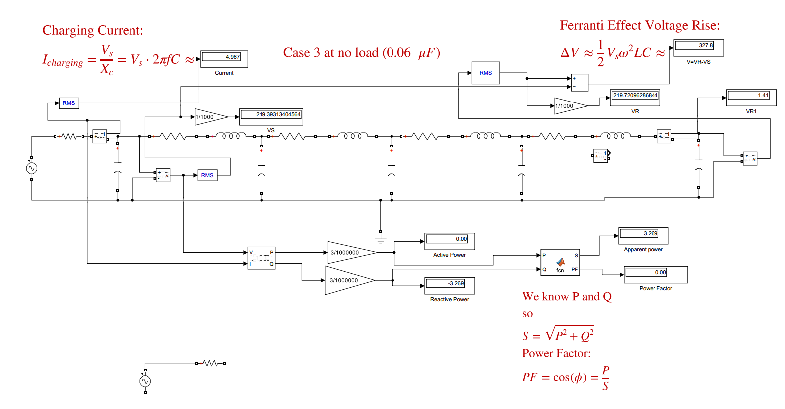
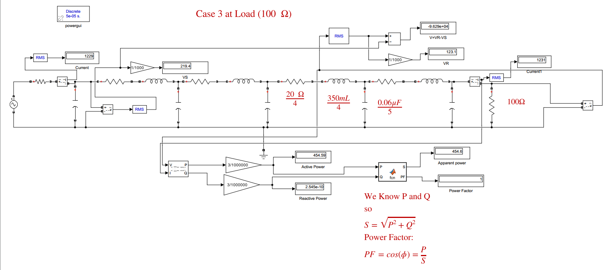

# ferrantiEffect
The Ferranti Effect is a critical power system phenomenon where the receiving-end voltage (Vr) exceeds the sending-end voltage (Vs) under light load or no-load.

##  Simulation Setup
We have followed the requirments of the file [**Power System Simulation Project (1).pdf**](ferrantiEffect/Document/Power%20System%20Simulation%20Project%20(1).pdf) 
##  Simulation Circuit

##  Simulation Result
The full simulation data is available in the [**ProjectExcelResultlast.xlsx**](ferrantiEffect/Document/ProjectExcelResultlast.xlsx) file.

This model requires the following software:

* **MATLAB:** Version 2016 or newer (as specified in the project document).
* **Simulink**
* **Simscape Electrical** / **Specialized Power Systems Toolbox**

To run the model:
1.  Clone this repository.
2.  Open the `Case3AtLoad100` file in MATLAB.
3.  Run the simulation. All readings will be available through display blocks in the model.

Aurthers [Turki Alzahrani,Omar Alghamdi,Hashim Althomali,Turki Althobiti]
